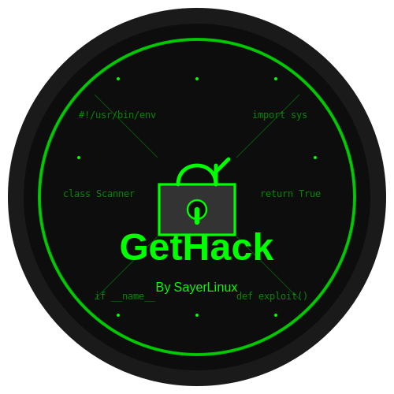

# GetHack - أداة اكتشاف واستغلال الثغرات الأمنية

<p align="center">
  
</p>

## نظرة عامة

GetHack هي أداة قوية مكتوبة بلغة Python لاكتشاف واستغلال الثغرات الأمنية في المواقع والخوادم المستهدفة. تقوم الأداة بفحص الهدف بحثًا عن الثغرات الشائعة، وتحليل نقاط الضعف، ومحاولة استغلالها، وإنشاء تقارير مفصلة عن النتائج.

**المطور**: SayerLinux  
**البريد الإلكتروني**: saudiSayer@gmail.com

## الميزات الرئيسية

- **فحص شامل للثغرات**: اكتشاف مجموعة واسعة من الثغرات الأمنية الشائعة.
- **استغلال الثغرات**: محاولة استغلال الثغرات المكتشفة لإثبات قابليتها للاستغلال.
- **جمع المعلومات**: جمع معلومات مفصلة عن الهدف، بما في ذلك سجلات WHOIS وDNS والمنافذ المفتوحة.
- **تقارير مفصلة**: إنشاء تقارير شاملة بتنسيق نصي وJSON.
- **واجهة سهلة الاستخدام**: واجهة سطر أوامر بسيطة وفعالة.

## المتطلبات

- نظام تشغيل Linux
- Python 3.6 أو أحدث
- امتيازات الجذر (root) للوصول الكامل إلى جميع الميزات

## التثبيت

```bash
# استنساخ المستودع
git clone https://github.com/SayerLinux/gethack.git
cd gethack

# تثبيت المتطلبات
pip3 install -r requirements.txt

# منح صلاحيات التنفيذ
chmod +x gethack.py
```

## الاستخدام

### الأمر الأساسي

```bash
sudo ./gethack.py -t <الهدف> [الخيارات]
```

### الخيارات المتاحة

```
الخيارات:
  -h, --help            عرض رسالة المساعدة هذه والخروج
  -t TARGET, --target TARGET
                        عنوان URL أو IP للهدف المراد فحصه
  -p PORTS, --ports PORTS
                        المنافذ المراد فحصها (الافتراضي: المنافذ الشائعة)
  -o OUTPUT, --output OUTPUT
                        مجلد حفظ التقارير (الافتراضي: ./reports)
  -v, --verbose         عرض معلومات تفصيلية أثناء الفحص
  -e, --exploit         محاولة استغلال الثغرات المكتشفة
  -j, --json            إنشاء تقرير بتنسيق JSON
  --threads THREADS     عدد مسارات التنفيذ المتزامنة (الافتراضي: 5)
```

### أمثلة

```bash
# فحص موقع ويب بحثًا عن الثغرات
sudo ./gethack.py -t https://example.com

# فحص خادم باستخدام عنوان IP مع تفعيل الاستغلال
sudo ./gethack.py -t 192.168.1.100 -e

# فحص منافذ محددة مع عرض معلومات تفصيلية
sudo ./gethack.py -t example.com -p 21,22,80,443,3306 -v

# فحص شامل مع إنشاء تقرير JSON
sudo ./gethack.py -t https://example.com -e -j -v
```

## الثغرات المدعومة

تقوم الأداة بفحص مجموعة واسعة من الثغرات الأمنية، بما في ذلك:

- حقن SQL (SQL Injection)
- Cross-Site Scripting (XSS)
- Cross-Site Request Forgery (CSRF)
- إعادة التوجيه المفتوح (Open Redirect)
- تضمين الملفات المحلية والبعيدة (LFI/RFI)
- ثغرات تحميل الملفات (File Upload Vulnerabilities)
- كشف المعلومات (Information Disclosure)
- رؤوس HTTP غير آمنة (Insecure HTTP Headers)
- برامج قديمة (Outdated Software)
- ثغرات الخدمات (FTP, SSH, Telnet, RDP, MySQL, etc.)

## هيكل المشروع

```
gethack/
├── gethack.py          # الملف الرئيسي للأداة
├── requirements.txt    # متطلبات Python
├── README.md           # ملف التوثيق
├── logo.svg            # شعار الأداة
├── modules/            # وحدات الأداة
│   ├── __init__.py     # ملف تهيئة الحزمة
│   ├── banner.py       # عرض شعار الأداة
│   ├── scanner.py      # وحدة فحص الثغرات
│   ├── exploiter.py    # وحدة استغلال الثغرات
│   └── reporter.py     # وحدة إنشاء التقارير
└── reports/            # مجلد حفظ التقارير
```

## ملاحظات هامة

- هذه الأداة مخصصة للاستخدام في اختبار الاختراق الأخلاقي وتقييم الأمان فقط.
- استخدم هذه الأداة فقط على الأنظمة التي لديك إذن صريح لاختبارها.
- المطور غير مسؤول عن أي استخدام غير قانوني أو غير أخلاقي لهذه الأداة.

## المساهمة

المساهمات مرحب بها! إذا كنت ترغب في المساهمة في تطوير هذه الأداة، يرجى اتباع الخطوات التالية:

1. قم بعمل fork للمستودع
2. قم بإنشاء فرع جديد للميزة الخاصة بك (`git checkout -b feature/amazing-feature`)
3. قم بتنفيذ التغييرات الخاصة بك
4. قم بعمل commit للتغييرات (`git commit -m 'إضافة ميزة رائعة'`)
5. قم بدفع الفرع الخاص بك (`git push origin feature/amazing-feature`)
6. قم بفتح طلب سحب (Pull Request)

## الترخيص

هذا المشروع مرخص بموجب رخصة MIT - انظر ملف [LICENSE](LICENSE) للحصول على التفاصيل.

---

<p align="center">
  تم تطويره بواسطة SayerLinux - saudiSayer@gmail.com
</p>